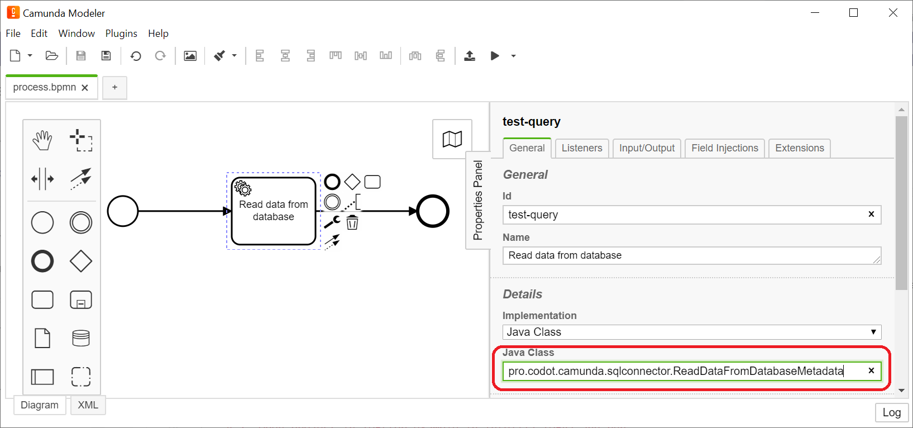
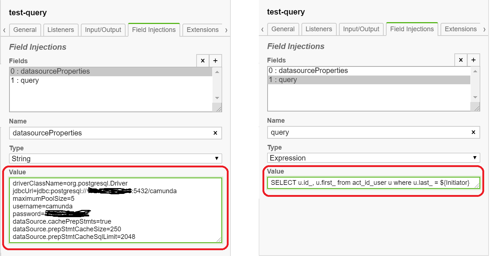

<h1> Reusable Sql-Connector for Camunda </h1>

This is example how to create simple database connector using JavaDelegate  

<h3>Configuration of SQL-Connector</h3>
There are two "Field injections" fields provided: "datasourceProperties" for database connections settings and "query" for SQL request definition  

<h3>How to run</h3>

**Run as Spring boot application.**
    
1. Open project in IDE(for example in Intellij IDEA) and run sql-connector/src/main/java/pro/codot/camunda/sqlconnector/Application.java

2. Go to http://localhost:8080/ using login/password - admin/admin

3. Go to Tasklist, and Start process "Test camunda sql connector"

4. Check application logs
    
**Run on shared Camunda server.**

1. Build application.

2. Copy file sql-connector-1.0.0-SNAPSHOT.jar from sql-connector/target/ into tomcat libs (for example into camunda-bpm-tomcat-7.14.0/server/apache-tomcat-9.0.36/lib/)

3. Copy libs HikariCP and Postgres (for example - HikariCP-3.4.5.jar and postgresql-42.2.14.jar) into tomcat libs (for example into camunda-bpm-tomcat-7.14.0/server/apache-tomcat-9.0.36/lib/)

4. Deploy sql-connector/src/main/resources/process.bpmn into camunda server via camunda modeler

5. Go to Camunda server for example to http://localhost:8080/ using login/password - demo/demo

6. Go to Tasklist, select process "Test camunda sql connector", and Start process

7. Check application logs